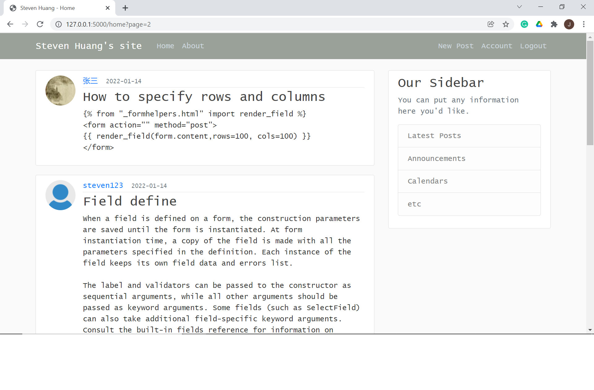

# Flask website
A exapmle of blog website developed based on [Flask](https://flask.palletsprojects.com/en/2.0.x/). This example website includes functions like user login/logout/register, publish/update/delete post, customize error pages, etc.

### Usage
1. Install requirement libraries </br>
```$ pip install -r requirements.txt```
2. Initialize the database  </br>
```$ python steup_db.py```
3. Start server  </br>
```$ python run.py```

### Sceenshots

